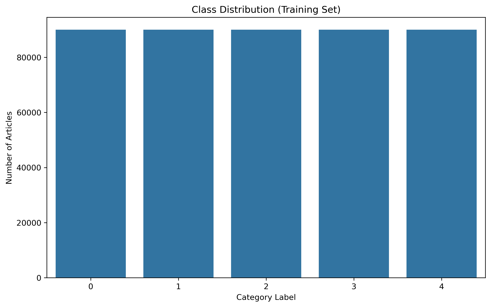
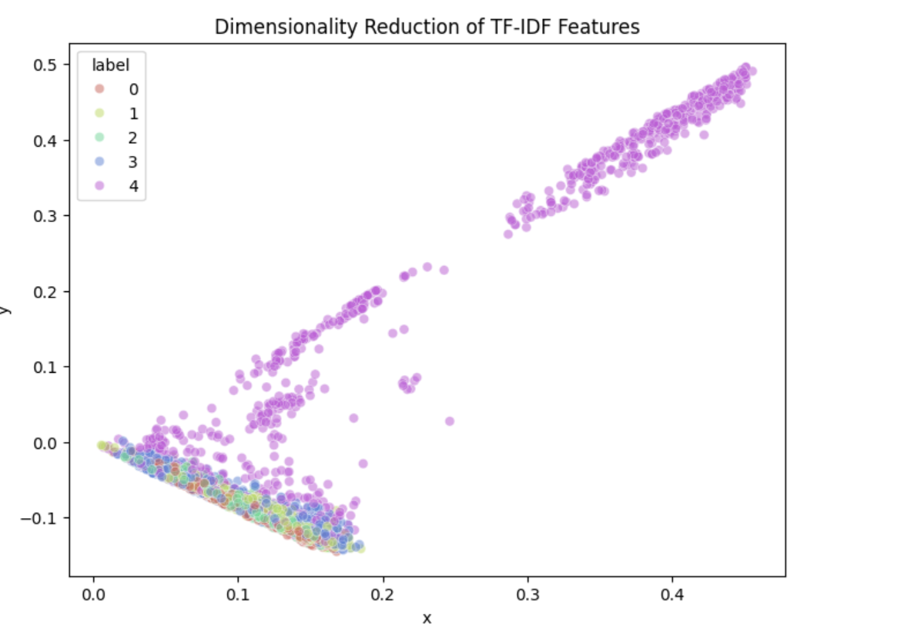

# ECEN 758 Project - Data Mining and Analysis (Fall 2025)

## Project Title - Comparative Analysis of Classical Machine Learning and Deep Neural Networks for Sogou News Classification

## Team: Group 6

### Team Members
- Harine Choi
- Wei-Chen Huang
- Harshavardhan Reddy Varicuti
- Shou-En Liu
### Abstract
This project examines several approaches for classifying news articles in the Sogou News dataset, which contains about 510,000 samples across five categories. We built a complete pipeline that includes dataset download from Hugging Face, data cleaning and normalization, exploratory analysis, and multiple supervised text classification models. Our main baselines use character-level TF-IDF features combined with three standard classifiers: Linear Support Vector Machines (LinearSVC), Multinomial Naive Bayes (MNB), and k-Nearest Neighbors (KNN). Trained on 450,000 examples and evaluated on the official 60,000-sample test split, the TF-IDF + LinearSVC model reached roughly 90% macro-F1 and 90% accuracy, outperforming the other classical baselines.
We further explored word-level TF-IDF with LinearSVC using randomized search, grid search, and Bayesian hyperparameter optimization to tune n-gram and regularization settings. To compare these feature-engineering methods with representation learning, we also implemented two convolutional neural networks: a basic 1D CNN and a TextCNN model with multiple kernel sizes and batch normalization. Both neural models operate on tokenized title-and-content sequences and are trained end-to-end with learned embeddings. The overall framework provides a clear comparison between sparse TF-IDF models and CNN-based models under a shared preprocessing pipeline, and it serves as a solid baseline for future work with deeper neural networks or transformer-based encoders.

### Dataset
- Name: SogouNews
- Number of Classes: Multi-class (5)
- Brief Description: SogouNews is a Chinese news dataset containing articles categorized into multiple classes. Our task is to classify the news into their corresponding categories.

### Model
- Model type: Multinomial Naive Bayes (MNB)/k-Nearest Neighbors (KNN)/Linear Support Vector Classifier (LinearSVC)/1D CNN/TextCNN.

# Methodology

## 1. Data Preprocessing
The dataset used is the Sogou News dataset (in pinyin) containing 510,000 rows. We applied a custom normalization pipeline:
**URL Removal:** Patterns matching `www`, `http`, and `https` were removed to prevent overfitting on hyperlinks.
**Whitespace Collapsing:** Tabs, newlines, and varying spaces were collapsed into single spaces.
* **Data Splitting:**
    * Training: 405,000 samples
    * Validation: 45,000 samples
    * Test: 60,000 samples.

## 2. Feature Engineering
We implemented a weighting strategy where the title is emphasized. The text input was constructed as:
`Text = Title + "[SEP]" + Title + Content`.
* Duplicating the title doubles the Term Frequency (TF) of key title words.
* Text was truncated to a maximum length of 3000 characters.

## 3. Exploratory Data Analysis (EDA)
**Class Distribution:** The training set is perfectly balanced with 90,000 articles per class.
**Length Distribution:** The mean article length is approximately 1,882 characters.

**

**Text Length Distribution Among Articles:** Most articles range from 300–800 characters, with many reaching the 3000-character limit, showing high variability in text length.

## 4. Dimensionality Reduction
To visualize the data, we used **Truncated SVD** to project high-dimensional TF-IDF vectors into 2D space.
**Observation:** Label 4 (Technology) formed a distinct, semi-isolated cluster, while other classes showed significant overlap.

**

# Experimental Results

## Model Performance Comparison
We compared margin-based, probabilistic, and distance-based learning. LinearSVC achieved the strongest results across all metrics.

| Model | Accuracy | Precision | Recall | F1-score |
|-------|----------|-----------|--------|----------|
| Naive Bayes | 0.91 | 0.92 | 0.91 | 0.91 |
| KNN | 0.96 | 0.96 | 0.96 | 0.96 |
| **LinearSVC** | **0.97** | **0.97** | **0.97** | **0.97** |

## Hyperparameter Tuning
We found that **Word-level TF-IDF (97%)** significantly outperformed Character-level TF-IDF (90%).
**N-gram settings:** The best performance was achieved with an n-gram range of **(1,3)**, likely because it captures short multi-word patterns common in pinyin.
  **Regularization:** Bayesian optimization found the best SVM C value at 8.365, though improvement over the default was minimal.

## Neural Network Comparison
We implemented a basic 1D CNN and an optimized TextCNN. 
These models did not surpass the classical TF-IDF + LinearSVC baseline.
The performance gap is likely due to training from scratch without pre-trained embeddings (like BERT or Word2Vec).

## Confusion Matrix Analysis
The final evaluation on the test set showed 97% accuracy. 
**Primary Error Source:** Confusion between **Finance (Label 1)** and **Technology (Label 4)**.
This suggests semantic overlaps in business and industry reporting between these categories.

**

0-sports, 1-finance, 2-entertainment, 3-automobile, 4-technology

# Conclusion & Future Work

## Conclusion
Our work demonstrates that traditional machine learning models maintain persistent effectiveness in high-dimensional text classification.
The **TF-IDF + LinearSVC** model was the most robust, achieving 97% accuracy.
Margin-based classifiers are highly appropriate for sparse, high-dimensional feature spaces.
Deep learning approaches (CNNs) are effective but require pre-trained embeddings to beat strong classical baselines in this specific pinyin context.

## Future Work
1.  **Advanced Preprocessing:** Use KeyBERT to extract representative keywords to better handle ambiguous classes.
2.  **Transformer Models:** Leverage pre-trained embeddings (Word2Vec, GloVe) or Transformer models (BERT, RoBERTa) to capture richer semantic information.

### Code & Demo
- GitHub code: [GitHub Notebook](https://github.com/wellsonhuang/ECEN-758-Fall-2025-Project)

### Dataset
- Dataset : [Dataset](https://huggingface.co/datasets/community-datasets/sogou_news)

### Download report
- report: [Download PDF](ECEN_758_Group_Project_Report.pdf)
### Notes
- This website summarizes the project completed for ECEN 758, focusing on multi-class class
